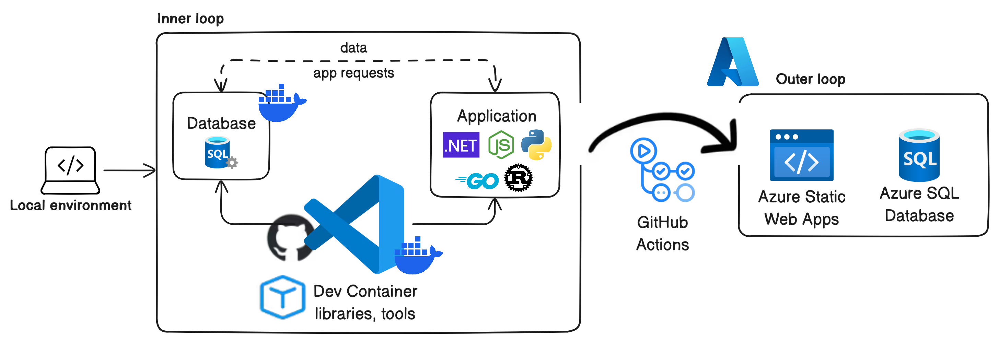

# Azure SQL Database Dev Container templates

Dev Container templates for building apps on Azure SQL Database. Each template gives you an app container for your language, a local SQL Server 2025 container, and a sample database defined in a SQL Database project that targets Azure SQL Database.



## Templates

| Template id | Language | App container base | `imageVariant` options |
|---|---|---|---|
| [`dotnet`](src/dotnet) | .NET | Ubuntu 24.04 (noble) | `10.0-noble` (default), `8.0-noble` |
| [`dotnet-aspire`](src/dotnet-aspire) | .NET with Aspire | Ubuntu 24.04 (noble) | `10.0-noble` |
| [`python`](src/python) | Python, with the `mssql-python` driver | Debian 13 (trixie) | `3.14-trixie` (default), `3.13-trixie` |
| [`javascript-node`](src/javascript-node) | Node.js, with the `mssql` package | Debian 13 (trixie) | `24-trixie` (default), `22-trixie` |

.NET 8 support ends on 2026-11-10. After that date, use `10.0-noble`.

Every template includes:

- SQL Server 2025 from `mcr.microsoft.com/mssql/server:2025-latest`, Developer edition.
- The `Library` sample database. It's built from the SQL Database project and published with SqlPackage when the container is created.
- The .NET SDK (.NET 10; the `dotnet` template also offers .NET 8), SqlPackage, `sqlcmd` (go-sqlcmd), Azure CLI with Bicep, and the Azure Developer CLI.
- VS Code tasks to verify the data and to build and publish the SQL Database project.

## How Azure SQL Database compatibility works

The local engine is SQL Server 2025, not Azure SQL Database. The SQL Database project targets Azure SQL Database (`SqlAzureV12DatabaseSchemaProvider`), so its build fails if the schema uses anything Azure SQL Database doesn't support. The build is the compatibility check. The local engine is not.

## Use a template

**VS Code.** Install Docker and the [Dev Containers extension](https://code.visualstudio.com/docs/devcontainers/containers). Open your project folder, press <kbd>F1</kbd>, and run **Dev Containers: Add Dev Container Configuration Files...**. Select **Show All Definitions...**, type **Azure SQL**, and pick a template. Then run **Dev Containers: Reopen in Container**.

**GitHub Codespaces.** In a codespace, run **Codespaces: Add Dev Container Configuration Files...** and follow the same steps. Then run **Codespaces: Rebuild Container**.

**Dev Container CLI.**

```bash
devcontainer templates apply -t ghcr.io/microsoft/azuresql-devcontainers/<id>
devcontainer up --workspace-folder .
```

Each template's README covers the tasks, the sample database, and the password setting.

## Apple Silicon

The app container runs natively on arm64. SQL Server 2025 has no arm64 image, so the SQL Server container runs as `linux/amd64` under emulation. Docker Desktop and OrbStack run it with Rosetta.

Microsoft does not test or support SQL Server under emulation. See the [SQL Server 2025 on Linux release notes](https://learn.microsoft.com/sql/linux/sql-server-linux-release-notes-2025?view=sql-server-ver17). Podman on macOS is known to crash SQL Server 2025 ([microsoft/mssql-docker#943](https://github.com/microsoft/mssql-docker/issues/943)). GitHub Codespaces runs on x64 hosts, where SQL Server runs natively.

SQL Server occasionally crashes while it starts, dumping core, and the container build then stops because the `db` service never becomes healthy. We saw it 1 start in 37 under emulation on an Apple Silicon Mac, and once on a native x64 GitHub Actions runner, so it is not specific to emulation. Run **Dev Containers: Rebuild Container** again, or restart the `db` container.

## Testing

Every pull request that changes a template runs that template's smoke test in GitHub Actions. The test applies the template, brings it up, and checks the sample database and the language sample.

To run the same checks on your machine, use `test/gauntlet.sh`. It needs Docker and the Dev Container CLI.

## Learn more

- [What are SQL database projects?](https://learn.microsoft.com/sql/tools/sql-database-projects/sql-database-projects?view=sql-server-ver17)
- [Target platform for SQL database projects](https://learn.microsoft.com/sql/tools/sql-database-projects/concepts/target-platform?view=sql-server-ver17)
- [SQL Server Linux containers](https://learn.microsoft.com/sql/linux/install-upgrade/quickstart-install-docker?view=sql-server-ver17)
- [Dev Container templates specification](https://containers.dev/implementors/templates/)

## Contributing and feedback

Report problems in [GitHub issues](https://github.com/microsoft/azuresql-devcontainers/issues). Contributions to the [templates](src) are welcome.

## License

Copyright (c) Microsoft Corporation. Licensed under the MIT License. See [LICENSE](LICENSE).
